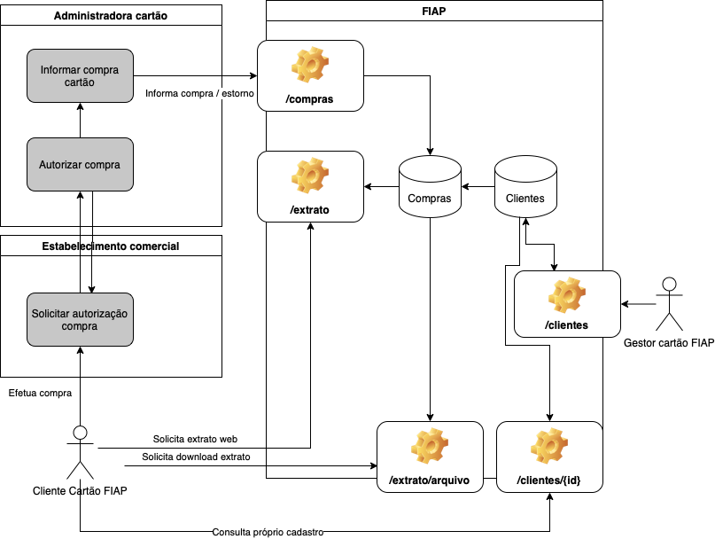
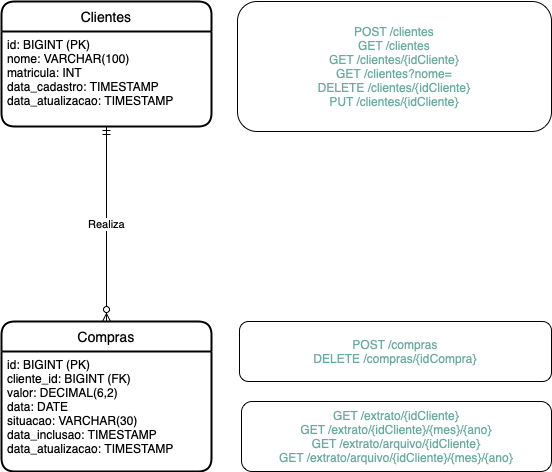

# Cartão FIAP 

## 🎯 Objetivo

Trata-se de um sistema para gerenciar movimentação e cadastramento de alunos que possuem cartões FIAP. 

## 📐 Projeto da aplicação

A aplicação está dividida em dois repositórios no GITHUB: 

1) [Aplicação Spring Boot Web](https://github.com/AlexDamiao86/CartaoFiap.git) - Disponibiliza endpoints para manutenção de cadastro de clientes, recebimento de transações realizadas nos cartões (compra/estorno), consulta extratos dos cartões. 

2) [Aplicação Angular](https://github.com/FabioQuimico/WebServicesFront.git) - Aplicação frontend desenvolvida em Angular que consome API Rest CartaoFiap (Aplicação Spring Boot Web). Autentica um usuário aluno e mostra o extrato do aluno autenticado.

### Visão Geral das Aplicações

A API possui controle de acesso implementado através do Spring Security utilizando JWT Token. Existem três perfis de usuário: 
- ALUNO - Permite a emissão de extrato, consulta do próprio cadastro. 
- GESTOR - Permite a manutenção do cadastro de clientes. 
- ADMIN_CARTAO - Permite informar compras autorizadas e compras estornadas do cliente cartão FIAP.  

Para chamar qualquer um dos endpoints disponíveis na API deverá ser feita primeiramente a autenticação do usuário através do endpoint (/usuarios/login). Segue na nota 1 abaixo, uma relação de e-mail/senha que poderá servir como entrada para requisição do endpoint de autenticação. 

Disponibilizamos o projeto da API através do Heroku no domínio https://cartao-fiap.herokuapp.com/. É possivel interagir com o webservice através do [Swagger](https://cartao-fiap.herokuapp.com/swagger-ui/index.html) - https://cartao-fiap.herokuapp.com/swagger-ui/index.html

Disponibilizamos o projeto web através do Heroku no domínio https://fintap-web.herokuapp.com. 

> **_NOTA 1:_** Criamos uma pequena massa de testes para possibilitar o teste da aplicação. Existem usuários cadastrados para cada um dos perfis de usuário. São eles: 
> - Perfil Aluno:
>   - E-mail: aluno@fiap.com.br / Senha: 123456
>   - E-mail: aluno2@fiap.com.br / Senha: 123456
> - Perfil Gestor: 
>   - E-mail: gestor@fiap.com.br / Senha: 123456
> - Perfil Administradora Cartão: 
>   - E-mail: autoriza@visa.com.br / Senha: 123456

### Modelo Entidade Relacionamento (Endpoints)

## 🛠️ Tecnologias utilizadas

Aplicação API:
- Linguagem Java (versão 1.8)
- [Spring Framework](https://spring.io)
  - [Spring Initializr](https://start.spring.io)
  - [Spring Data JPA](https://spring.io/projects/spring-data-jpa)
  - [Spring Boot Web](https://spring.io/projects/spring-boot)
  - [Spring REST Doc](https://spring.io/projects/spring-restdocs)
  - [Spring Security](https://spring.io/projects/spring-security)
- [Gradle (Gerenciador de dependências)](https://gradle.org)
- [Github (Controle de versão)](https://github.com)
- [Docker](https://www.docker.com)
- [Heroku](https://heroku.com)
- [H2](https://www.h2database.com)
- [Swagger](http://swagger.io)
- [Flyway](https://flywaydb.org)

Aplicação Cliente (Angular):
- [Angular](https://angular.io)
- [Node](https://nodejs.org/)
- [Heroku](https://heroku.com)

## ⚙️ Como executar o projeto localmente

### Rodando o webservice 

> **_NOTA 2:_** Esse passo não é necessário para rodar a aplicação cliente localmente, pois a aplicação web foi configurada para consumir os endpoints diretamente do domínio publicado no Heroku. 

Como informado acima, o projeto do webservice foi publicado no Heroku. No entanto, se desejar rodar o projeto da API localmente deverá proceder os seguintes passos: 

1. Clonar projeto Spring Web do GitHub: 
~~~bash
git clone https://github.com/AlexDamiao86/CartaoFiap.git
~~~
2. Importar o projeto na sua IDE de preferência (atualizar o build.gradle).
3. Configurar variáveis de ambiente na sua IDE de preferência. Exemplo: 
~~~yaml
PORT=8081
DATASOURCE_URL=jdbc:h2:~/fiapdb/cartao-fiap
DATASOURCE_USERNAME=fiap
DATASOURCE_PASSWORD=fiap
JWT_SECRET=F14P
JWT_EXPIRATION_MINUTES=5
~~~
4. Executar o arquivo /src/main/java/CartaoApplication.java.

Alternativamente, pode-se substituir os passos 1 a 4 pela execução do container Docker (exige Docker em execução) através do seguinte comando no terminal: 
~~~bash
docker run -p 8081:8081 -e PORT='8081' -e DATASOURCE_URL='jdbc:h2:~/fiapdb/cartao-fiap' -e DATASOURCE_USERNAME='fiap' -e DATASOURCE_PASSWORD='fiap' -e JWT_SECRET='F14P' -e JWT_EXPIRATION_MINUTES='5' alexdamiao86/cartao
~~~

5. Interagir na aplicação através do [Swagger](http://localhost:8081/swagger-ui/index.html#/).
6. Possibilidade de visualizar os dados no [h2-console](http://localhost:8081/h2-console/).

### Rodando a aplicação cliente

O projeto web foi publicado no Heroku através do endereço - https://fintap-web.herokuapp.com. No entanto, se desejar rodar a aplicação cliente localmente deverá proceder os seguintes passos: 

1. Clonar projeto Angular no GitHub (terminal): 
~~~bash
git clone https://github.com/FabioQuimico/WebServicesFront.git
cd WebServicesFront/
~~~
2. Abrir o projeto na sua IDE de preferência (sugerido VSCode) - apenas se desejar consultar código (opcional). 
3. Executar os comandos abaixo para carregar dependências e executar aplicação (terminal):
~~~bash
npm install 
npm run build
npm start 
~~~

## 👨🏽‍💻 Desenvolvedores

| [ Alexandre Damião Mendonça Maia](https://github.com/AlexDamiao86) |  [ Fabio Ferreira dos Santos](https://github.com/FabioQuimico) |  [ Gabriel Oliveira Barbosa](https://github.com/Gabriel2503) | [ Rafael Braga da Silva Ferreira](https://github.com/ferreirabraga) | 
| :---: | :---: | :---: | :---: |

>
>Projeto realizado como requisito para conclusão da disciplina WebServices do MBA Full Stack Development - FIAP 2022
>
>[Prof. Eduardo Galego](https://github.com/prof-eduardo-galego)
